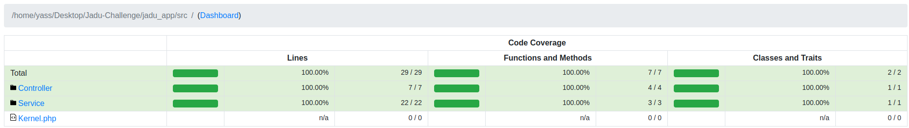
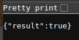

# Project Title
Jadu PHP Technical Challenge

# Description
This App was created to showcase the process getting checking for\
Palindromes, Anagrams, and Pangrams.

# Completed Requirements
* The app is written in PHP - Symfony.
* The app is accessible from all modern web browsers (i.e. Chrome, Firefox).
* The application successfully checks if a word is Palindrome.
* The application successfully checks if a word is an anagram of another.
* The application successfully checks if a word is a Pangram.

# Design
Is Palindrome: O(n)
- Clean any chars other than A-Z and digits
- Get word in lower case
- Compare reverse of the word to the original

Is Anagram: O(n)
- Clean any chars other than A-Z and digits (in both word and comparison)
- Get words in lower case
- Get each character by its index and how many times it occurs in an array
- Compare both words generated arrays

Is Pangram: O(n)
- Get all alphabets in lower case
- Clean any chars other than A-Z and digits
- Get phrase in lower case
- Check if each alphabet exists in phrase

# Technologies
- Language = PHP
- Framework: Symfony
- Tests: phpUnit
- Responses: JsonResponse

# Test Coverage

# Used functions References
- strrev: https://www.php.net/manual/en/function.strrev.php
- count_chars: https://www.php.net/manual/en/function.count-chars.php

# GUI routes
- /isPangram/{word}
- /isAnagram/{word}/{comparison}
- /isPangram/{phrase}

# GUI response
1- Response Format:\

# Installation steps (Linux/Ubuntu)
- Clone Git repo
- Install Symfony CLI: https://symfony.com/download
- Install Composer: https://getcomposer.org/download/
- Run: composer update in terminal
- Start PHP server